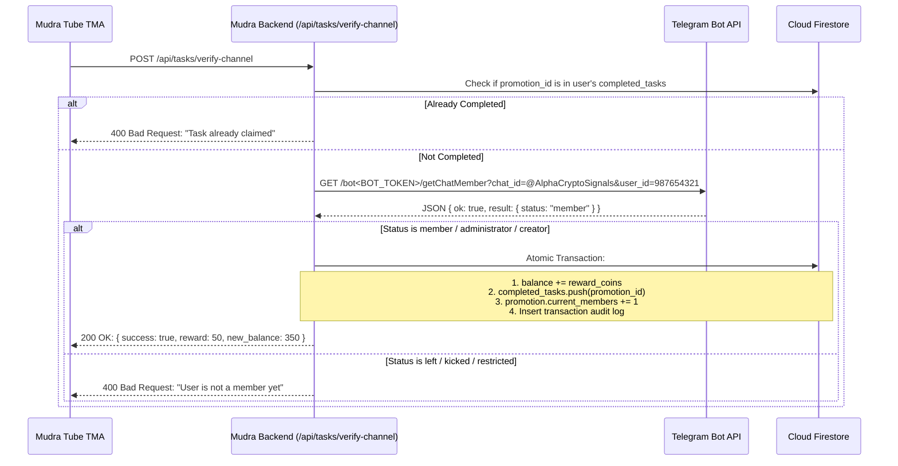

# 🔌 API & Integration Specification: Mudra Tube

This document details all technical integrations, endpoints, and external communications for Mudra Tube:
1. **Telegram WebApp SDK Client Layer**
2. **Telegram Bot API Channel Verification**
3. **CPA Offerwall Dynamic Tracking & Webhook Postback**
4. **Withdrawal Processing API**
5. **Stealth Admin Panel Gate & Control APIs (`/admin-penel-29devs`)**

---

## 1. Telegram WebApp SDK Integration

### 1.1 Initialization Script
Embedded in HTML head:
```html
<script src="https://telegram.org/js/telegram-web-app.js"></script>
```

### 1.2 Client-Side Lifecycle & Styling
```typescript
import type { TelegramWebApps } from 'telegram-web-apps';

export function initializeTelegramApp() {
  const tg = window.Telegram?.WebApp;
  if (!tg) {
    console.warn("Mudra Tube running in external browser mode.");
    return null;
  }

  // Expand to full screen view
  tg.ready();
  tg.expand();
  
  // Enable close confirmation to protect unsubmitted forms
  tg.enableClosingConfirmation();

  // Match native theme to Liquid Glassmorphic Sky
  tg.setHeaderColor?.('#F0F9FF');
  tg.setBackgroundColor?.('#F0F9FF');

  return {
    user: tg.initDataUnsafe?.user,
    initDataRaw: tg.initData,
    haptics: tg.HapticFeedback,
    openLink: tg.openLink.bind(tg),
    openTelegramLink: tg.openTelegramLink.bind(tg),
  };
}
```

### 1.3 Haptic Feedback Triggers
Used on all tactile button taps to evoke a native mobile feel:
```typescript
export const haptic = {
  tap: () => window.Telegram?.WebApp?.HapticFeedback?.impactOccurred('light'),
  buttonPress: () => window.Telegram?.WebApp?.HapticFeedback?.impactOccurred('medium'),
  success: () => window.Telegram?.WebApp?.HapticFeedback?.notificationOccurred('success'),
  error: () => window.Telegram?.WebApp?.HapticFeedback?.notificationOccurred('error'),
};
```

---

## 2. Channel Verification API (Telegram Bot API)

To protect the `BOT_TOKEN` from browser inspection, all verification requests are made via a backend server route.

### Endpoint: `POST /api/tasks/verify-channel`

#### Request Payload
```json
{
  "user_id": "987654321",
  "channel_id": "@AlphaCryptoSignals",
  "promotion_id": "promo_abc123"
}
```

#### Verification Flow


#### Bot API Response Status Reference
- `creator` $\rightarrow$ Valid member (Pass)
- `administrator` $\rightarrow$ Valid member (Pass)
- `member` $\rightarrow$ Valid member (Pass)
- `restricted` $\rightarrow$ Pass if `is_member: true`
- `left` $\rightarrow$ Failed (Not joined)
- `kicked` $\rightarrow$ Failed (Banned from channel)

---

## 3. CPA Offerwall Tracking & Postback Webhook

### 3.1 Offerwall Dynamic Link Generation
Each user is provided a unique URL embedding their Telegram ID in the `subid` parameter:
```typescript
export function getOfferwallUrl(baseUrl: string, userId: string): string {
  const url = new URL(baseUrl);
  url.searchParams.set('subid', userId);
  return url.toString();
}
// Example: https://partner-cpa.com/offers?app_id=4521&subid=987654321
```

### 3.2 Postback Webhook: `GET /api/webhooks/cpa-postback`
Executed automatically by the CPA provider upon offer completion.

#### Query Parameters
- `subid`: User ID (`987654321`)
- `reward_coins`: Reward amount earned (e.g. `200`)
- `payout_usd`: Advertiser payout (e.g. `0.25`)
- `campaign_id`: Campaign reference ID
- `sig`: HMAC-SHA256 signature calculated with pre-shared secret key

#### Security Verification
```typescript
import crypto from 'crypto';

export function verifyCpaSignature(subid: string, reward: number, receivedSig: string, secretKey: string): boolean {
  const hash = crypto.createHmac('sha256', secretKey)
                     .update(`${subid}:${reward}`)
                     .digest('hex');
  return crypto.timingSafeEqual(Buffer.from(hash), Buffer.from(receivedSig));
}
```

---

## 4. Withdrawal Lifecycle API

### Endpoint: `POST /api/withdrawals/create`

#### Request Payload
```json
{
  "user_id": "987654321",
  "payout_method": "UPI",
  "payout_address": "trader99@okaxis",
  "coins": 300
}
```

#### Validation & Atomic Deduction Rules
1. Validate `coins >= global_config.min_withdrawal_coins`.
2. Check `user.balance >= requested coins`.
3. Validate `payout_address` syntax:
   - For UPI: Valid VPA format (`username@bank`).
   - For TON: Valid base64/hex TON address (`UQ...` or `EQ...`).
4. Execute Firestore Atomic Transaction:
   - Deduct `coins` from `users/{user_id}.balance`.
   - Increment `users/{user_id}.total_withdrawn`.
   - Calculate `amount_fiat = coins / coins_per_inr`.
   - Create document in `withdrawals` with status `pending`.

---

## 5. Stealth Admin Portal APIs (`/admin-penel-29devs`)

### 5.1 Route Obfuscation & Gatekeeper
- The admin dashboard is located at `/admin-penel-29devs`.
- HTTP Header Protection:
  ```http
  X-Robots-Tag: noindex, nofollow, noarchive
  Cache-Control: no-store, max-age=0
  ```

### 5.2 Admin Authentication: `POST /api/admin/login`
```json
{
  "username": "admin_29devs",
  "password": "MasterSecurePassword#2026"
}
```
- Authenticates against securely salted hashes in environment variables.
- On success: Issues an `HttpOnly`, `SameSite=Strict`, `Secure` session cookie with JWT payload.

### 5.3 Admin Control Endpoints

| Method | Path | Description |
| :--- | :--- | :--- |
| `GET` | `/api/admin/overview` | Platform KPI stats (Total Users, Coins Circulating, Pending Withdrawals, Total Paid) |
| `GET` | `/api/admin/users?query=&page=1` | Filtered user list with balances |
| `POST` | `/api/admin/users/adjust` | Manual credit or debit with reason: `{ userId, deltaCoins, note }` |
| `GET` | `/api/admin/withdrawals?status=pending` | List all payout tickets |
| `POST` | `/api/admin/withdrawals/resolve` | Update status: `{ withdrawalId, status: "completed"\|"rejected", refund: true, utr: "..." }` |
| `GET/POST`| `/api/admin/config` | Read or update global platform settings & toggles |
| `POST` | `/api/admin/promotions/moderate` | Approve or reject pending channel campaign requests |
| `POST` | `/api/admin/packages/save` | Create or update pre-defined package bundles |
