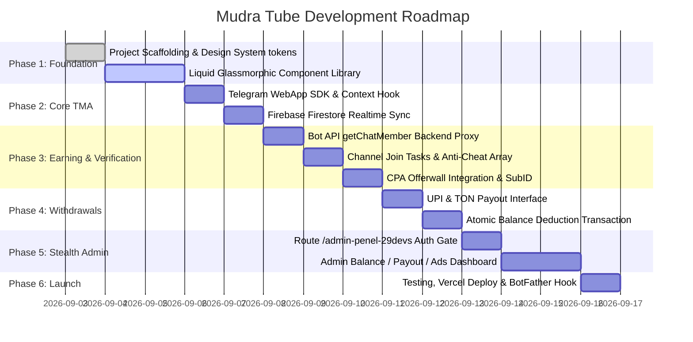

# 🚀 Deployment Guide & Implementation Roadmap: Mudra Tube

This document provides a comprehensive step-by-step technical guide for configuring, deploying, and scaling the Mudra Tube Telegram WebApp and its hidden Administrative Control Center (`/admin-penel-29devs`).

---

## 1. Environment Variables Configuration (`.env.example`)

```env
# =======================================================
# 1. CLIENT FIREBASE CONFIGURATION
# =======================================================
NEXT_PUBLIC_FIREBASE_API_KEY="AIzaSyYourApiKeyHere..."
NEXT_PUBLIC_FIREBASE_AUTH_DOMAIN="mudra-tube.firebaseapp.com"
NEXT_PUBLIC_FIREBASE_PROJECT_ID="mudra-tube"
NEXT_PUBLIC_FIREBASE_STORAGE_BUCKET="mudra-tube.appspot.com"
NEXT_PUBLIC_FIREBASE_MESSAGING_SENDER_ID="123456789012"
NEXT_PUBLIC_FIREBASE_APP_ID="1:123456789012:web:abcdef123456"

# =======================================================
# 2. TELEGRAM BOT CREDENTIALS (BACKEND ONLY - KEEP SECRET)
# =======================================================
TELEGRAM_BOT_TOKEN="7123456789:AAFxYourTelegramBotTokenHere"
TELEGRAM_BOT_USERNAME="MudraTubeBot"

# =======================================================
# 3. ADMINISTRATIVE SECURITY GATE (/admin-penel-29devs)
# =======================================================
ADMIN_SECRET_ROUTE="/admin-penel-29devs"
ADMIN_USERNAME="admin_29devs"
ADMIN_PASSWORD_HASH="$2b$10$YourBcryptSaltedHashPasswordHere"
ADMIN_JWT_SECRET="super-secret-jwt-signing-key-32-chars-minimum"

# =======================================================
# 4. CPA OFFERWALL CREDENTIALS
# =======================================================
CPA_OFFERWALL_BASE_URL="https://your-cpa-provider.com/wall?app_id=123"
CPA_POSTBACK_SECRET="cpa-webhook-signature-secret-key"

# =======================================================
# 5. PLATFORM BASE URL
# =======================================================
NEXT_PUBLIC_APP_URL="https://mudratube.vercel.app"
```

---

## 2. Telegram Bot & Channel Configuration

### Step 1: Create the Telegram Bot
1. Open Telegram and search for [@BotFather](https://t.me/BotFather).
2. Send `/newbot` and follow the prompts to choose a Name (e.g., `Mudra Tube Earning`) and Username (e.g., `MudraTube_bot`).
3. BotFather will provide an API token in the format `123456789:ABCdefGhIJKlmNoPQRsTUVwxyZ`. Store this securely as `TELEGRAM_BOT_TOKEN`.

### Step 2: Configure the Mini App Web Menu Button
1. In @BotFather, send `/mybots`.
2. Select your newly created bot.
3. Click **Bot Settings** $\rightarrow$ **Menu Button** $\rightarrow$ **Configure menu button**.
4. Enter the live URL of your deployed application (e.g., `https://mudratube.vercel.app`).
5. Set the button title to: `🪙 Earn Coins` or `🚀 Open App`.

### Step 3: Add Bot as Channel Administrator
> [!IMPORTANT]
> To verify whether a user is an active member via the `getChatMember` API, the bot **must be added as an Administrator** in every channel promoted on the platform.
1. Open the target Telegram channel.
2. Go to **Channel Settings** $\rightarrow$ **Administrators** $\rightarrow$ **Add Administrator**.
3. Search for `@YourBotUsername` and add it with the default permissions (View messages / Members list).

---

## 3. Firebase Console Setup

### Step 1: Project Creation
1. Navigate to the [Firebase Console](https://console.firebase.google.com/).
2. Click **Add Project**, enter name `mudra-tube`, and disable Google Analytics for minimal latency if desired.

### Step 2: Enable Cloud Firestore
1. In the sidebar, select **Build** $\rightarrow$ **Firestore Database**.
2. Click **Create Database**, select a region close to your primary audience (e.g., `asia-south1` for India).
3. Start in **Production Mode**.
4. Deploy the rules specified in [`DATABASE_SCHEMA.md`](./DATABASE_SCHEMA.md).

### Step 3: Seed Global Config Document
In Cloud Firestore, create collection `global_config` and add document `platform_settings`:
```json
{
  "min_withdrawal_coins": 300,
  "coins_per_inr": 300,
  "coins_per_ton": 50000,
  "default_task_reward": 50,
  "channel_tasks_enabled": true,
  "offerwalls_enabled": true,
  "maintenance_mode": false,
  "maintenance_message": ""
}
```

---

## 4. Implementation Roadmap (Phases)



---

## 5. Deployment Options

### Deploying to Vercel (Recommended)
1. Push the project repository to GitHub or GitLab.
2. Link the repository in the [Vercel Dashboard](https://vercel.com).
3. Under **Environment Variables**, add all keys listed in the `.env.example` section above.
4. Deploy with build command: `npm run build` or `pnpm build`.

---

## 6. Anti-Cheat & Security Checklist

- [x] Telegram Bot token is **never exposed** in client-side bundles; all verification runs via server proxy.
- [x] All task rewards check Firestore `completed_tasks` array before awarding coins.
- [x] Minimum withdrawal limit enforced server-side.
- [x] Admin route (`/admin-penel-29devs`) protected with `noindex, nofollow` headers and rate-limited authentication.
- [x] Double-spending prevented using atomic Firestore transactions (`runTransaction`).
