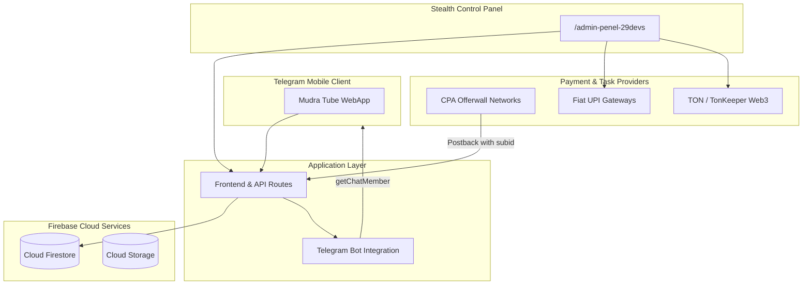
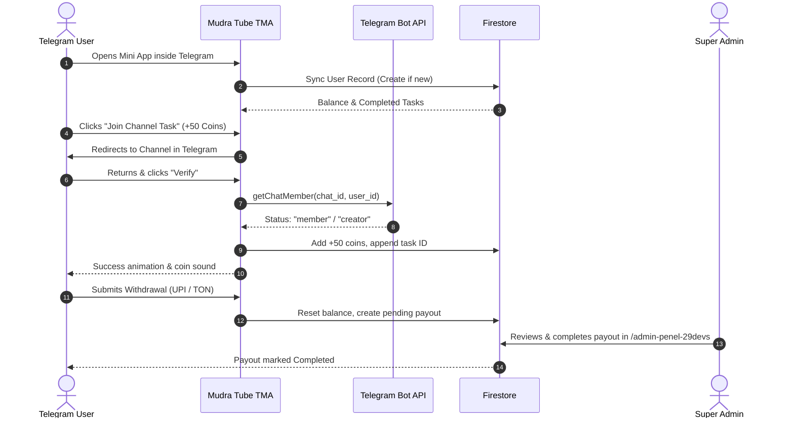

# 📱 Mudra Tube (मुद्रा ट्यूब)

> **Next-Generation Telegram WebApp for Rewarded Tasks & Crypto/UPI Payouts with Liquid Glassmorphic Light Sky UI/UX**

Mudra Tube is an ultra-modern, mobile-first Telegram Mini App (TMA) ecosystem designed to provide a transparent, ad-free earning platform. Users complete verified Telegram Channel joins and high-paying CPA offerwall tasks (surveys, app installs) to earn virtual coins, redeemable directly via **UPI (Fiat INR)** or **TON/USDT (Crypto via TonKeeper)**. 

The platform features an external channel promotional marketplace and a dedicated, obfuscated administrative portal (`/admin-penel-29devs`).

---

## 🌟 Core Highlights

- 💧 **Liquid Glassmorphic UI/UX**: Light sky blue aesthetic with translucent frosted glass cards, soft aquatic reflections, tactile mobile buttons, and native app gestures.
- ⚡ **Zero-Latency Live Verification**: Direct integration with Telegram Bot API (`getChatMember`) ensures instant verification without manual review delays.
- 🛡️ **Multi-Tier Anti-Cheat Engine**: Prevents double-claiming via indexed task arrays, device context validation, and dynamic CPA subid tracking.
- 💸 **Dual Payout Pipeline**: Seamless withdrawals to Indian bank accounts via UPI (`user@upi`) and Telegram Web3 ecosystem via TON/USDT.
- 🔒 **Stealth Administrative Dashboard**: Secure, unindexed control panel hosted at `/admin-penel-29devs` with session security, real-time user balance controls, and payout moderation.
- 📢 **Channel Promotion Marketplace**: Self-serve or pre-packaged promotion plans for Telegram channel admins to acquire verified active members.

---

## 📂 Project Documentation Structure

| Document | Description |
| :--- | :--- |
| 🎨 [`DESIGN_SYSTEM.md`](./DESIGN_SYSTEM.md) | Liquid Glassmorphic Light Sky UI/UX specifications, design tokens, button geometry, and mobile app feel. |
| 📋 [`PRD_SPECIFICATION.md`](./PRD_SPECIFICATION.md) | Comprehensive Product Requirements Document combining Mini App, Admin Panel, and Ad Marketplace. |
| 🗄️ [`DATABASE_SCHEMA.md`](./DATABASE_SCHEMA.md) | Firestore NoSQL architecture, data models, indexing strategy, and security rules. |
| 🔌 [`API_AND_INTEGRATION_SPEC.md`](./API_AND_INTEGRATION_SPEC.md) | Telegram WebApp SDK, Bot API endpoints, CPA postback webhooks, and auth gateway specs. |
| 🚀 [`DEPLOYMENT_AND_ROADMAP.md`](./DEPLOYMENT_AND_ROADMAP.md) | Step-by-step setup, Firebase configuration, BotFather integration, and development milestones. |

---

## 🛠️ Architecture & Tech Stack

### Technology Breakdown
- **Frontend / Mini App Framework**: React 19 / Next.js 15 or Vite SPA + Tailwind CSS
- **Design Tokens**: Custom Liquid Glassmorphism (`backdrop-blur`, translucent specular borders, light sky linear gradients)
- **State Management & Database**: Firebase Cloud Firestore (Real-time `onSnapshot` listeners)
- **Telegram Ecosystem**: `@telegram-apps/sdk` / `window.Telegram.WebApp` + Telegram Bot API
- **Web3 Payments**: TON Connect SDK + TonKeeper deep-links
- **Icons & Motion**: Lucide React + Framer Motion (for liquid fluid animations and tactile button press response)

---

## 👥 User Roles & Workflow

---

## 🔐 Security & Anti-Fraud Standards

1. **Hidden Route Security**: Administrative path is isolated at `/admin-penel-29devs`, blocked from web crawlers (`X-Robots-Tag: noindex, nofollow`).
2. **Server-Side Verification**: Telegram Bot token is never bundled in client code. Verification requests route through secure API endpoints.
3. **Array-Guarded Tasks**: `completed_tasks` array locks verified tasks in Firestore, preventing replay attacks or bot spamming.
4. **Dynamic SubID Tracking**: CPA Offerwall URLs inject verified Telegram user IDs, verifying conversions cryptographically via postback webhooks.

---

## 📄 License & Attribution
Developed for Mudra Tube (29 Devs). All rights reserved.
